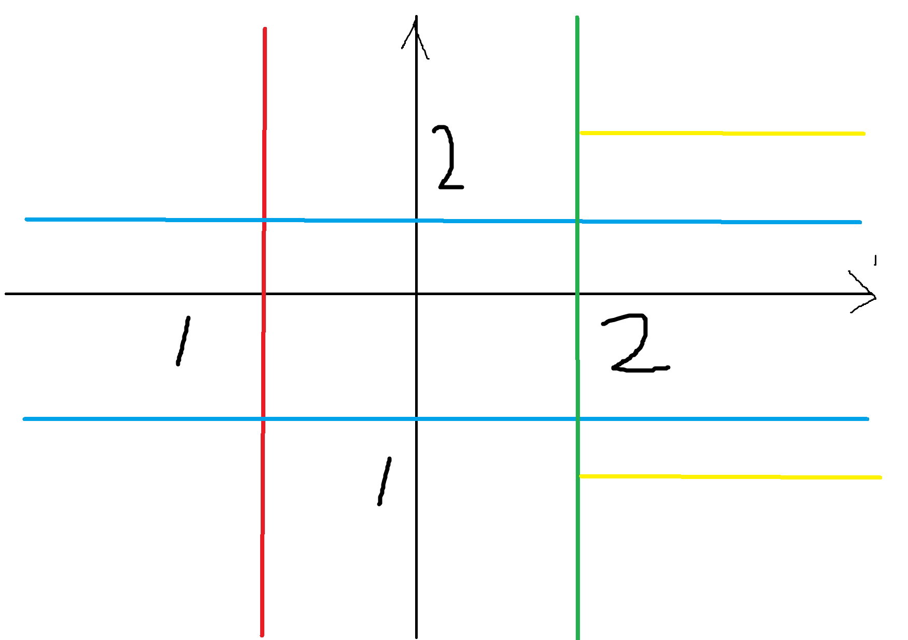

# [2020ICPC南京](https://codeforces.com/gym/102992)

| 排名               | 当场过题数 | 至今过题数 | 总题数 |
| ------------------ | ---------- | ---------- | ------ |
| 现场3/547 CF36/856 | 8          | 11          | 13     |

## **A**

**upsolved by **

### 题意

### 题解

## **B**

**upsolved by **

### 题意

### 题解

## **C**

**upsolved by TYB**

### 题意

二维平面上有$n$​个点，第$i$个点的坐标为$(x_i,y_i)$，当你的位置在$(x,y)$时，可以覆盖所有$x_i=x$或$y_i=y$的点。你的初始位置为$(0,0)$，求最小移动距离，使得可以覆盖所有点。

$n\le10^5,-10^9\le x_i,y_i\le10^9$

### 题解

可以发现，最终能覆盖哪些点只与四个方向移动的最大距离有关，且沿$x$轴的两个方向中，其中一个距离的贡献系数为$1$，另一个为$2$，$y$轴同理。由于可以旋转，不妨假设只有下图这一种情况：

考虑如何计算答案。我们强制向左最多走到红线的位置并枚举这条红线，那么红线和$y$​​轴之间的点已被覆盖，红线左边的点只能被蓝线间的区域覆盖。如此一来，则只剩第一象限蓝线上的点和第四象限蓝线下的点没被覆盖。假设这些点由绿线和黄线共同覆盖，考虑绿线的位置，发现其对答案的贡献是一个分段函数。那么只要二分求出各个函数的分界点，对每个区间求最值即可。由于没有修改，可以用RMQ预处理，$\mathcal{O}(1)$​询问函数的区间最值。至于系数问题，只要把对应区域内点的横或纵坐标$\times2$即可。

实现时有较多细节和边界条件。

## **D**

**upsolved by TYB**

### 题意

给一个$n$个点$m$条边的无向连通图，找一棵生成树，使得度数最大的点度数$\le\lfloor\frac{n}{2}\rfloor$。

$n\le10^5,m\le2\times10^5$

### 题解

先随便找一棵生成树，若不符合条件（最多只有一个节点不符合），将该节点看作根，每次找一条没用过的边，且该边的两个节点最近公共祖先为根，加上这条边，断掉根和其中一个儿子的根，这样就能让度数$-1$。可以证明若有解一定能通过这样调整出来。具体实现用一个并查集即可。

## **E**

**solved by TYB**

### 题意

给出一个长度为$n$由若干上下左右组成的移动序列，你需要重新排列这个序列，使得机器人从$(0,0)$出发不会经过一个给定的点$(x,y)$，给出方案或判断无解。

$\sum n\le10^6$

### 题解

可以证明若有解，则存在一种答案，使得相同的方向是连续排在一起的。枚举UDLR的$24$种排列即可。

## **F**

**solved by YZW**

### 题意

### 题解

## **G**

**upsolved by TYB**

### 题意

### 题解

点双乱搞。

## **H**

**solved by JLK**

### 题意

有一个$n \times m$的矩阵，每个格子要填$\{0,1,2\}$​之一。问所有填法中，至少存在一个长方形的四个顶点满足条件的方案数。

条件为：上方两个数字相等且下方两个数字相等。或者左边两个数字相等且右边两个数字相等。

$1 \le n,m \le 2 \times 10^3$

### 题解

不难发现，只要行或者列有一个超过9，并且另一个至少是2时，由于两个格子的数字对只有九种，一定会重复出现，所以所有方案都合法。

只需要考虑$n,m\le 9$​的情况。其实不合法的情况很少，直接爆搜即可。需要预处理再回答询问，否则会TLE。

## **I**

**solved by JLK**

### 题意

$-m \le x \le m$，$y$方向无限长的滑雪道，初始在$(0,-inf)$，$v_y$为定值。有$n$​​个障碍物线段（互不相交），不能穿过障碍物，要到达$(0,inf)$，求$v_x$最小值。

$1 \le n \le 100,1 \le m \le 10^4$

### 题解

最优路径下，一定是从起点开始，经过若干个线段的端点，然后到终点。

起点和终点设置为$\pm 10^{18}$即可。

把所有合法的端点拉出来按$y$排序（合法指不与边界相交）。$dp_i$​表示到达$i$点时的最小$v_x$。每次枚举一个后面的端点，然后$O(n)$​扫一遍判断是否合法即可。合法则转移。

$O(n^3)$

## **J**

**solved by TYB**

### 题意

给出一个长度为$n$​的序列$\{a_n\}$，两种操作：

<code>1 l r x</code>：对于$\forall i\in[l,r],a_i=\max(a_i,x)$。

<code>2 l r x</code>：进行一个共$r-l+2$堆石子的经典取石子游戏（若干堆石子，每次从其中一堆取正整数个，无法操作者输），对于第$i$($1\le i<r-l+2$)堆石子，石子数为$a_{l-1+i}$，最后一堆石子石子数为$x$​，求先手有多少种方案能赢。

$n,q\le2\times10^5,0\le x,a_i\le2^{30}-1$

### 题解

设$s=sum_{l,r}\oplus x$，$sum_{l,r}$为区间$[l,r]$的异或和，则操作$2$实际上求的是区间有多少个$i$满足$a_i\oplus s<a_i$。考虑从高位开始逐位比较，比到$s$的最高位的$1$所在的位置时两数一定不同，满足条件当且仅当$a_i$那个位置上也为$1$。所以我们要维护两个信息，一个是区间异或和，一个对于每个位，区间有多少个数这个位上是$1$。由于$1$操作，容易联想到<code>Segment Tree Beats</code>，发现可做，直接抄板子就行了。

## **K**

**solved by YZW**

### 题意

### 题解

## **L**

**solved by YZW**

### 题意

### 题解

## **M**

**solved by JLK**

### 题意

一棵以1为根的树，每个点有权值$hp_i$​​，现在要把所有点删掉。

对于某个点$i$​，只有它父亲被删掉时才能删掉它。删掉它的代价为，$hp_i+\sum\limits_{j\in son_i\&alive_j}hp_j$​。

对于每个$m=0,1,\dots ,n$，求出可以施法免费删除$m$个点的情况下，删掉整棵树的最小代价。

$2 \le n \le 2 \times 10^3$

### 题解

首先定义正常情况下删除$i$​的代价$A_i=hp_i+\sum\limits_{j \in son_i}hp_j$​。

考虑施法删除一个点会发生什么。如果是1，那么总代价可以减去$A_i$。如果不是1，总代价可以减去$A_i+hp_i$（它的父节点处的代价会减少$hp_i$​）。

而且，如果一个点和它的父亲都被施法删除了，那么会多减去一个$hp_i$，需要加回去。

不难设计一个$dp_{i,j,0/1}$表示$i$的子树内，施法删除了$j$个，$i$这个点是否被施法删除。然后枚举子树大小按上面说的转移即可，复杂度为$O(n^2)$​。

## **记录**

YZW过K(0:08)，然后TYB写E，但WA了。

JLK和TYB讨论，YZW过L(0:22)。

E改了一下，又WA一次后AC(0:32)。

JLK写M，调了一段时间后AC(1:10)。

YZW尝试F，然后AC(1:16)。

TYB说J是板子题，开始抄板子。JLK和YZW看H。

发现性质后准备尝试，JLK顶下TYB开始写H，TLE一次后AC(2:23)。

TYB过J(2:25)。

YZW本地试了一下A，没搞出来，D也想不出来。

后来JLK发现I可做，然后AC(3:35)。

YZW开始乱搞A。还剩1h时TYB会C了，敲了一会感觉没时间，三人一起搞A。

最后试了很多次没过。

## **总结**

TYB：像D这种题可以多尝试，调整和随机的思路都不难实现，思路要拓宽。

## **Dirt**

E(-2)

H(-1)
